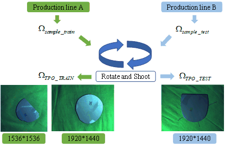
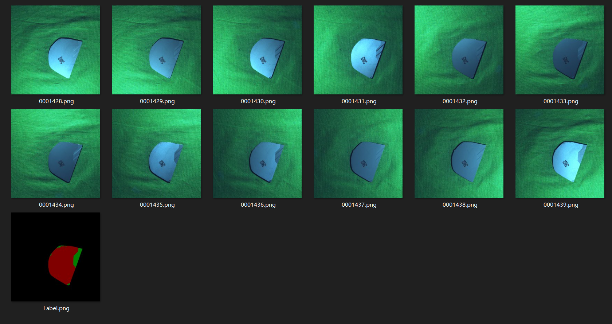

# Self-collected dataset from real industrial scene named Twelve CdZnTe crystal images Plus One corresponding label (TPO)

# Overview

The TPO dataset was obtained by photographing CdZnTe samples from real industrial scene.

# Split

The TPO dataset contains 4884 groups CdZnTe crystal images, which includes 3990/894 groups for training and test：
|     Dataset       |        Resolution                         |        Number     | 
| :---              | :-----------------:                       | :--------------:  | 
| Training set      | $1920 \times 1440$ and $1536 \times 1536$ | 3990              |            
| Test set          | $1536 \times 1536$                        | 894               |           

# Examples

   

# Copyright

The TPO dataset is available for the academic purpose only. Any researcher who uses the TPO dataset should obey the licence as below:

This dataset is for non-commercial use only. All of the TPO Dataset are copyright by MePro, Center of Digital Media Information Processing, BJTU. This means that you must attribute the work in the manner specified by the authors, you may not use this work for commercial purposes and if you alter, transform, or build upon this work, you may distribute the resulting work only under the same license.

# Download
Please download the [Release Agreement](./Assets/releaseagreement.pdf), read it carefully, and complete it appropriately. Note that the agreement needs a handwritten signature by a full-time staff member (that is mean student is not acceptable). We will only take applications from organization email (please DO NOT use the emails from gmail/163/qq). Anyone who uses the TPO dataset should obey the agreement and send us an email for registration. Please scan the signed agreement and send it to Mepro_BJTU@hotmail.com. Then we will verify your request and contact you on how to download the data.

# Citation

# version

  This is version 0.1

  2022.11.24
